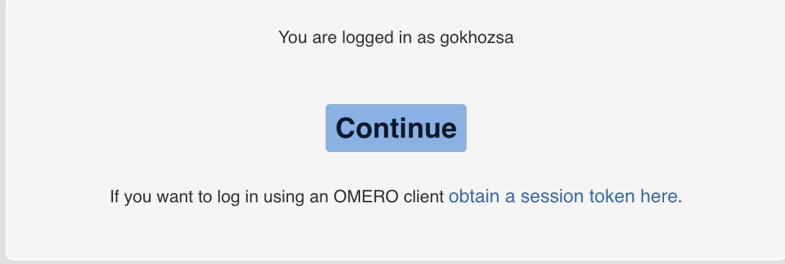

# Accounts and login

How you get an account once your project is approved, and how to sign in.

You sign in once, through your own institution, and that single sign-in serves
both kinds of client. The browser carries it for you. Everything else uses the
session token that the same sign-in produced.

## Getting an account

There is no OMERO sign-up form, and you never create an OMERO account yourself:
it is created for you once you belong to an approved project. Where the SUPR
account comes from depends on which side of the proposal you are on.

If you are the one submitting the proposal, you need a SUPR account first,
because SUPR is where the proposal is submitted. Register yourself at
[SUPR](https://supr.naiss.se) using your own university or institution login.
There is nothing to ask us for at that stage.

If you are being added to a project that already exists, whether a research
project or a facility delivery project, there is nothing for you to do. Whoever
administers the project adds you to it in SUPR, an account is created for you if
you do not already have one, and the matching OMERO account and group membership
follow. The project's allocation becomes visible to you on the SUPR side too.

Either route ends with you being a member of at least one OMERO group; see
[Groups and membership](groups-and-membership.md).

Your OMERO username is your SUPR username. It is usually the first four
characters of your first name followed by the first four of your last name,
sometimes with digits appended to keep it unique, so Jonas Anderson becomes
`jonaande`. It is how you appear to the rest of your group, and it is shown to
you at sign-in, so there is no need to guess it. You will not have to type it
into anything: no client on this service asks for it.

## Signing in for the first time

Go to the [web client](/webclient/). OMERO sends you to SUPR, which authenticates
you against your own university or institution account, and then hands you back.
SUPR accepts both SWAMID, the Swedish identity federation, and eduGAIN, its
international counterpart. There is no OMERO password to set or remember: you
are never asked for one.

Authenticating creates a session, and an interim page confirms who you are and
offers the two ways of using it.

Press **Continue** to go to the web client. [First steps](first-steps.md) picks
up from there.

### Using the session token in the desktop and API clients

OMERO.insight, Fiji, napari, the Python API and the command line all connect
over port `4064`, which is not a web port and cannot carry a browser-based
single sign-on. They reuse the session you have already created instead, and the
token on that interim page is the handle to it. There is nothing extra to
generate: signing in is what produced it.

!!! tip "The token goes in both fields"

    Enter the token as **the username and the password**, the same string in
    both boxes. This is not a mistake in the instructions. It is how OMERO lets
    a client attach to an existing session, and it is why your SUPR username is
    not needed anywhere.

Follow **obtain a session token here** on the page above, copy the token, and
paste it into both fields of the client's login dialog. A token grants
everything your account can do, so treat it like a password: do not commit it to
a repository or paste it into a shared document.

The client pages cover the dialogs themselves:
[OMERO.insight](../clients-and-apis/omero-insight.md),
[Fiji and ImageJ](../clients-and-apis/fiji-imagej.md),
[napari](../clients-and-apis/napari.md),
[Python API](../clients-and-apis/python-api.md) and
[command line](../clients-and-apis/command-line.md). For an unattended batch
job, the same token is the session key described in
[Working from an HPC system](../workflows/hpc.md).

### How long a token lasts

As long as you keep using it. Activity refreshes the session, so a client you
work in every day, or a long analysis that is steadily reading from the server,
keeps its own token alive. What ends a session is a stretch of inactivity, not
elapsed time since you fetched it, and closing your browser does not by itself
disconnect a client that is still working.

The practical consequence is that a token you set aside goes stale. When a
client that worked last week is refused today, sign in again and copy the new
token. See [Troubleshooting](../reference/troubleshooting.md).

## Signing in from outside Sweden

A collaborator abroad does not need a Swedish identity. SUPR, which handles the
authentication, accepts eduGAIN as well as SWAMID, so an account at a European
university normally works directly at the same sign-in page. Everything after
that is identical, session token included.

!!! info "If your institution is not in the federation"

    eduGAIN covers academic institutions. Someone at a hospital, region,
    company or research institute, or at a university outside the federation,
    may have no federated login to use. We have not documented a route for that
    case yet, so email [omero@scilifelab.se](mailto:omero@scilifelab.se) before
    you count on a collaborator being able to sign in.

## Adding people to your group

Not in OMERO. Membership is administered in the SUPR project that your
allocation belongs to, and SUPR synchronises the change to your OMERO group.
Adding someone to the project in SUPR adds them to the group; removing them
there removes their access. Nobody inside the group can administer it from the
OMERO side, because this service does not use OMERO's group owner role.

[Groups and membership](groups-and-membership.md) has the detail, and
[Sharing with collaborators](../using-omero/sharing.md) covers what a new member
can then do with your data, which on this service is everything.

## Losing access when an allocation ends

You get one month of notice by email before an allocation ends. When it does,
your account is disabled and the project's data is deleted, with no grace period
after the deadline. A renewal or extension is requested in SUPR while the notice
period is still running.

[When your project ends](../data-management/end-of-project.md) sets out the
timeline and what to export before it runs out.
